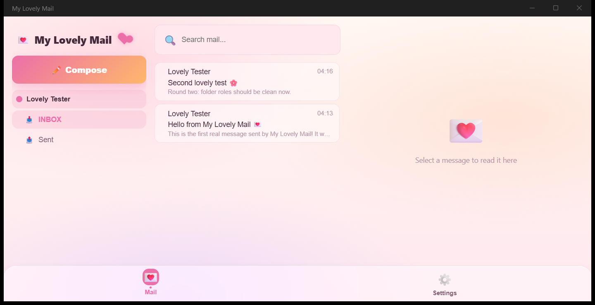
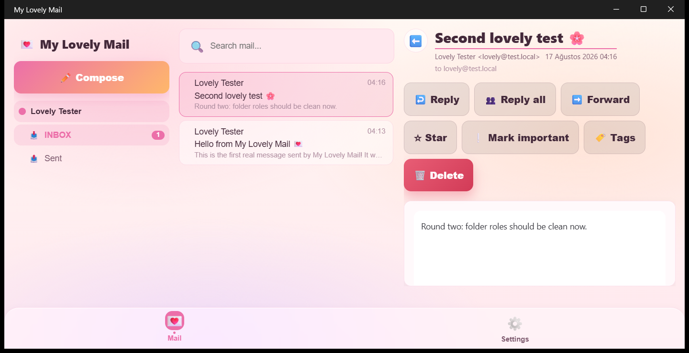

# My Lovely Mail


A desktop mail client for Windows with a pastel, glass-styled interface. It receives mail over
IMAP or POP3, sends over SMTP, stores full messages on disk (only lightweight summaries stay in
RAM), and renders HTML mail inside a sandboxed frame after stripping active content.

The UI is Blazor running inside .NET MAUI (BlazorWebView). All CSS values — colors, spacing,
typography — are emitted from C# constants, so the same tokens are usable from both C# and markup,
and switching the theme re-skins the whole app at runtime.

| Inbox | Reading pane |
| --- | --- |
|  |  |

## Features

**Accounts and sync**
- IMAP (incremental UID-based sync, UIDVALIDITY invalidation) and POP3 accounts; SMTP sending
- Account wizard with server presets (Gmail, Outlook, Yahoo, iCloud, Yandex, custom), a
  connection test, and a per-account accent color that tints the workspace
- Periodic background sync with a configurable interval; manual sync from the UI or tray
- Folder roles resolved from IMAP SPECIAL-USE, with name-based fallback for servers without it
- All network calls go through one Polly pipeline (retry with backoff, per-attempt and total timeouts)

**Settings with live inheritance**
- Global settings persist as a plain `key = value` text file
- Every account holds `InheritedSetting<T>` children: until a value is overridden for that
  account, it follows the global value live; only overridden keys are written to disk
- A per-account settings page shows each value with an inherited/overridden badge and a reset button

**Reading**
- HTML bodies rendered in a sandboxed iframe after sanitization (scripts, event handlers,
  `javascript:` URLs, embeds and forms are stripped; `cid:` images are inlined as data URIs)
- Remote images blocked by default with a per-message "show once" override
- Attachment strip: save one or all attachments into Downloads
- Mark-as-read on open (optionally delayed), conversation-independent unread tracking

**Organization**
- Filter rules: conditions (from/to/subject/preview/domain/size/attachment, AND-OR, regex) and
  actions (move to a server or local folder, mark read/important/starred, mute, per-rule
  notification sound, add tag), edited in a dedicated page, executed during sync
- Colored tags with a picker; tag chips on list rows; tag search
- Cross-folder search with `from:` `to:` `tag:` `has:attachment` `is:unread` `is:starred`
  operators and saved-search chips
- Multi-select (checkboxes, Ctrl+Click, Ctrl+A) with a bulk actions bar
- Keyboard triage: J/K navigation, Enter, U (read), S (star), I (important), Delete, `?` for help

**Composing**
- Reply / reply-all / forward with quoted bodies parsed from the cached MIME
- Drafts autosave into a local Drafts folder after ~3 s idle; drafts reopen in the compose pane
- Sent messages are appended to the server Sent folder (or a local one for POP3)

**Desktop integration**
- System tray icon with menu, close-to-tray, start minimized, start-with-Windows registry entry
- Windows toast notifications for new mail, honoring per-account settings, quiet hours, rule
  mutes and per-rule sounds; clicking a toast opens the message
- Message list density modes (Cozy / Comfortable / Compact), two shipped themes, log viewer page

## Security architecture

- **Credential vault**: account passwords are never stored in plain text. Two at-rest modes:
  - *DPAPI* (default): encrypted with the Windows user's data protection key. Opens
    automatically on this machine; a copied `UserData` folder cannot be decrypted elsewhere.
  - *Master password*: AES-256-GCM with a key derived via PBKDF2 (SHA-256, 200k iterations).
    Portable, unlocked through a dedicated lock screen; a wrong password is rejected by the
    GCM tag check. The mode can be switched both ways from Settings, and the vault can be
    locked on demand.
- **Migration bundle**: one file containing settings, accounts, filters and tags plus a
  passphrase-encrypted portable copy of the vault. Cached mail is intentionally excluded and
  re-syncs on the target machine.
- **HTML sanitization**: message HTML never runs scripts; the iframe is sandboxed and remote
  images are blocked by default so tracking pixels do not fire.
- **Debug surface**: the localhost REST API used by automated tests is compiled only into
  DEBUG builds; release builds contain none of it.

## On-disk layout

The deployed app manages its own folder tree next to the launcher:

```
MyLovelyMail\
├─ MyLovelyMail.exe      launcher: starts AppData\MyLovelyMail.exe, forwards arguments
├─ AppData\              application files (replaced by updates)
├─ UserData\             settings, accounts, filters, tags, credential vault
├─ UserCache\            synced mail (safe to delete — re-downloads from the server)
└─ AppCache\             app-only re-creatable data (safe to delete)
```

## Building

Requirements: .NET 10 SDK with the MAUI workload, Windows 11.

```powershell
git clone https://github.com/muhammetozeski/MyLovelyMail.git
cd MyLovelyMail
dotnet build MyLovelyMail\MyLovelyMail.csproj -f net10.0-windows10.0.19041.0
```

`Export.ps1` publishes a complete versioned deployment (app + launcher) into a target folder:

```powershell
.\Export.ps1 -DeployRoot "D:\Apps\MyLovelyMail"
```

The solution also contains a Blazor Web head (`MyLovelyMail.Web`) used during development to
preview the shared UI in a browser, and a Roslyn source generator that turns the page list into
navigation constants at compile time.

## Project structure

```
MainProject\           shared library: all UI (Blazor) and services
├─ DataModels\Mail\    accounts, folders, message summaries, filter rules, drafts
├─ Services\Mail\      IMAP/POP3/SMTP engine, rules, compose, notifications, rendering
├─ Storage\            AppPaths, disk-backed MessageStore (RAM keeps summaries only)
├─ Stores\             settings engine, account/filter/tag stores, credential vault
└─ UI\                 pages, components, theme constants (CSS emitted from C#)
MyLovelyMail\          MAUI head: window, tray, toasts, startup wiring
MyLovelyMail.Web\      ASP.NET Core head for browser preview during development
Generators\            incremental source generator for navigation constants
```
